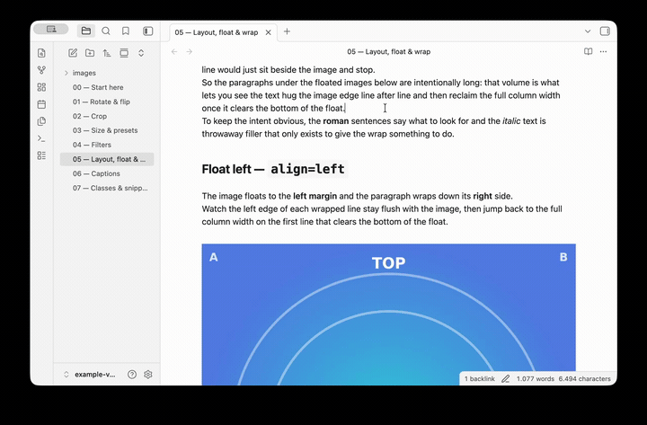

# Live Image Editor

Non-destructive image editing for Obsidian. Crop, rotate, flip, resize, and apply CSS filters — all live, without modifying the original file.



## Features

- **Toolbar on selection** — appears when you click an image, same trigger as Obsidian's native resize handles
- **Crop with free rotation** — fixed frame, freely move/rotate/scale the image underneath
- **CSS Filters** — brightness, contrast, saturation, hue, blur, grayscale, sepia with a side panel and live histogram
- **Filter Presets** — one-click looks (B&W, Vintage, Warm, Cool, Sepia, ...)
- **Resize** — scale up/down, custom dimensions, or predefined size classes
- **Flip & Rotate** — horizontal/vertical flip, 90° steps or free rotation via crop
- **Inline/Block toggle** — switch between text-wrapping and standalone display
- **CSS class management** — auto-detects classes from your vault's CSS snippets
- **Export** — render all edits to a new image file (original stays untouched)
- **Editing Toolbar integration** — optionally registers commands as buttons in [Editing Toolbar](https://github.com/pkm-er/obsidian-editing-toolbar)
- **Multilingual** — follows Obsidian's language setting

## How it works

Edits are stored as a small, portable attribute block **after** the image embed — standard
Markdown/wiki syntax, never the alt text or the file. The original image is never touched.

```markdown
{rotate=90 width=420}
![[photo.png]]{align=left filter="sepia(0.8)"}
{transform="translate(-50%,-50%) scale(2)" aspect-ratio=1/1 width=260 .rounded}
```

The block uses bare keys (`align`, `width`, `rotate`, `flip`, `transform`, `filter`,
`aspect-ratio`, `.class`) — the same portable format MkDocs-Material / Python-Markdown / Pandoc
understand. Open the note **without** the plugin and the image still shows: `align`/`width` carry
through any renderer, and the rest fall back to the original, untransformed image. Obsidian's native
wiki-link size (`![[image.png|300]]`) continues to work and is preserved.

## Example vault

[`example-vault/`](example-vault/) is a self-contained Obsidian vault that demonstrates **every**
feature on synthetic, committable images (corner labels **A/B/C/D** + a **TOP** marker make
rotate/flip obvious). To try it:

1. In Obsidian, **Open folder as vault** → pick the `example-vault/` directory.
2. Enable **Live Image Editor** in *Settings → Community plugins* (install it first if needed —
   see [Installation](#installation)).
3. Open **`00 — Start here`** and work through the numbered pages (Rotate & flip, Crop, Size,
   Filters, Layout, Captions, Classes). Hover an image to reveal the toolbar and edit away.

Two features ship opt-in — turn them on from *Settings → Live Image Editor*: **Show image captions**
and **Install example snippets** (the latter is already installed and enabled in this vault).

## Documentation

📖 **[Documentation site](https://britz.github.io/obsidian-live-image-editor/)** — the user guide,
the demo vault (with images rendered *live* by the plugin's runtime) and the design docs, published
from `docs/` via ProperDocs + MaterialX (the maintained MkDocs / Material forks).

- **[User guide](docs/user-guide.md)** — how to use every feature, with screenshots.
- **[`example-vault/`](example-vault/)** — a demo vault that shows each feature on real images
  (open it as a vault with the plugin enabled; start at *00 — Start here*).
- **[Development docs](docs/development/README.md)** — the design docs (requirements, architecture,
  plan, tests, the bug & lesson registry) **and the developer workflow**: building from source, the
  dev/debug loop, and previewing this docs site locally.

## Installation

1. Download the latest release from [Releases](https://github.com/Britz/obsidian-live-image-editor/releases)
2. Extract into your vault's `.obsidian/plugins/live-image-editor/` directory
3. Enable the plugin in Settings > Community Plugins

## Development & Release compliance

Building the plugin from source, the watch / dev-install loop, live debugging in Obsidian (CDP), and
previewing the docs site locally are all covered in the
**[Development docs](docs/development/README.md)** — everything builds inside the devcontainer.

**Release compliance.** Before each community-directory submission the plugin is audited against
Obsidian's **Developer policies**, **Plugin guidelines** and **Submission requirements**. All
`R1–R30` rules are met — the former open items were closed in the v0.4.2 release-compliance pass. The
v0.6.x **automated review** (`eslint-plugin-obsidianmd` + a CSS scan) is reproduced locally
(`npm run lint:obsidian` / `npm run lint:css`, separate from the shipped linter — T9) and reports 0
errors; the kept warnings (architecturally-required `:has`, justified `!important`, the 1.12.7-floor
API deprecations) and the false positives (the dev-only CDP bridge, the standalone runtime bundle)
are documented with their rationale there. The full audit + submission checklist live in
**[Release compliance](docs/development/release-compliance.md)**.

## File system access & platform support

**File system access.** Almost everything the plugin does stays inside your vault and is fully
non-destructive — the original image file is never modified. The **one** exception is the **Export
as image** action: on desktop it opens your operating system's native *Save* dialog, so you can
write the rendered (transformed/filtered) copy to **any location you choose, including outside the
vault**. Nothing is written outside the vault without you picking that location in the dialog. On
mobile (no native dialog) export falls back to an in-app prompt that writes a copy **inside** the
vault.

**Platform support (`isDesktopOnly: false`).** The plugin runs on both desktop and mobile. Two
features use Electron/Node APIs that only exist on desktop, and both degrade gracefully on mobile:
the **export save dialog** (mobile writes into the vault instead) and the **macOS two-finger
trackpad rotate gesture** in the crop editor (the on-screen rotate handle is always available as the
fallback). The access is dynamic and feature-detected, so core editing — rotate, flip, crop, resize,
filters, classes — works on mobile too.

**Reporting cross-platform issues.** Development and testing happen on **macOS**, so that's the
best-exercised platform; Windows, Linux, iOS and iPadOS should work but see less testing. If
something misbehaves on a non-macOS system — **especially native-OS behaviour** such as the crop
**trackpad rotate gesture** or the **save dialog / file menu** — please open a GitHub issue **with
screenshots**; platform-specific problems are far easier to pin down that way.

## License

[MIT](LICENSE)
