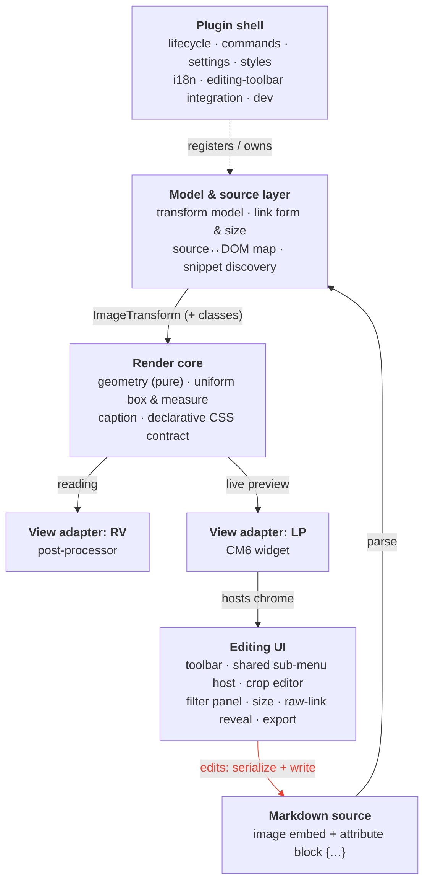

# Architecture — Live Image Editor

> The architecture artifact — the **Mid-level concept** from `methodology.md`: *how* the
> requirements in `requirements.md` are realized, conceptually. It records the building blocks
> and their responsibilities, the data flow, how they interact, and the load-bearing decisions
> that make the requirements achievable as one coherent whole.
>
> **Abbreviations:** **AD** = Architecture Decision (§2); **AB** = Architecture Building Block
> (§4); **Fn / Dn / Tn** = the functional / design / technical requirements in `requirements.md`,
> where those references point.
>
> Everything here is stated as **concepts**: files, functions and other code internals are the
> implementation plan's job, not this document's — the sole exception being framework names
> (Obsidian / JS / CSS) where the platform forces them.

---

## 1. Shape at a glance

Four layers, plus a plugin shell that wires them together. The data flows in one direction
for rendering and round-trips through the source for editing.

The **render** direction (source down to pixels) is a pure function of the source. The
**edit** direction — the red edge closing the loop: Editing UI → write to source → re-parse →
re-render — is the only way display state changes; there is no second store to keep in sync
(AD1).

---

## 2. Load-bearing decisions

These are the cross-cutting decisions that make the requirements hold together. They are the
reason the module decomposition looks the way it does; most are already embodied in the
current code and are restated here as architecture, not invented anew.

- **AD1 — Source is the single source of truth.** *(F1, F2, F3, T2)* The displayed image is a
  pure projection of the current Markdown; all transform state lives in the trailing
  attribute block and nowhere else. Every edit serializes back into that block and re-parses,
  so no cached or stale render state can survive a mode switch or a reused embed. The model
  layer owns parse/serialize; the editing UI never mutates display state directly, only the
  source.

- **AD2 — Declarative rendering contract; portable attribute keys routed per layer.** *(T2, T3,
  F1, F25)* Transforms are stored **declaratively** in the trailing `{…}` block as a portable
  attribute list — never imperative DOM scripting. The block is **not** "all transforms as native
  CSS": it is a set of **bare keys** (`align`, `width`, `rotate`, `flip`, `transform`, `filter`,
  `aspect-ratio`) plus `.class` and a `style=` escape (grammar in T2.3). Native CSS is used **only
  for the faithful subset** — `align` (legacy HTML float / center) and `width` (a real HTML
  attribute) render with no plugin and no shipped CSS; a `style="filter:…"` escape likewise stays
  faithful. The **runtime-only** keys (`rotate`, `flip`, the inner crop `transform`, and a bare
  `filter=`) have no faithful native path — `transform` does not reflow, so a rotated **footprint**
  needs its own element, and a browser ignores a bare `filter` attribute (the faithful filter path
  is the `style="filter:…"` escape) — and are realized by the render core / runtime (so the runtime
  must claim a bare `filter=` image too, AB7a), degrading to the original image otherwise (F25).
  Each datum is routed to the layer it must act on (AD3, 3-layer model):
  `align` / `width` / `aspect-ratio` / `style` / `.class` → the **outer** (the flow footprint);
  `rotate` + `flip` → the **inner-frame** (orientation + crop clip); `transform` (crop placement)
  + `filter` → the **``** (content). A `filter` and a `transform` value pass through
  **verbatim** to the `` (a power user's extra `filter` functions or affine `transform`
  functions just work); only the editing tools and the rotated-footprint reflow read the one token
  they need. *(Implemented — `align`, `width`, orientation (`rotate`/`flip`), the crop placement
  (`transform`), the cut shape (`aspect-ratio`) and `filter` are all bare keys routed per layer; a
  non-px `width` (preset var / %) and a `height`/box passthrough use the `style=` escape. The parser
  still reads the legacy forms — `style="transform:…"`, the `.lie-left/right/center` classes,
  `style="width:…"` — for back-compat. Presets are baked to a literal `width=N`.)*

- **AD3 — One uniform 3-layer image element, one sizing direction (R0).** *(T5, T6, D3, D4)*
  Normal, rotated, flipped, cropped, filtered and sized images share the **same** nested structure
  and the **same** sizing routine; "normal" is the degenerate transform, never a special case. The
  uniform structure is **three layers**, each owning one concern (this is the realization of the
  "uniform wrapper", T5):
  - **outer** — the **flow participant / footprint**: carries `width`, `aspect-ratio`, `align`,
    `style`, `.class`. It reserves the (possibly swapped) flow space and **does not rotate**, so
    the footprint stays correct even though `rotate` would not reflow.
  - **inner-frame** — **orientation + crop clip**: carries `rotate` + `flip` on **one** element
    (composed in written `{}` order) and **clips its content**.
  - **``** — **content**: carries the crop `transform` (pan / zoom / optional content-rotate)
    and `filter`.

  This decoupling is load-bearing: re-orienting (the inner-frame) never touches the crop placement
  on the ``, so no coordinates are recomputed by hand; the footprint is reserved
  independently, so the rotated **box-swap** is solved; `rotate` + `flip` share one element so the
  written order composes directly; and `flip`-inner ∘ `rotate`-frame reaches all eight
  orientations, so the reverse order is never needed. The frame clips **uniformly** (crop is not a
  structural fork — just the case with content beyond it). Sizing runs **one way: the stored size
  sizes the outer, and the inner content is a pure function of the outer and the transform** —
  never the reverse; the permanent guard against the recurring rotated-image sizing drift (no
  measure-then-resize loop). Layout and alignment act on the **outer** (the document-flow
  participant), not the image, so surrounding text wraps. *(Implemented — the plugin builds the three
  layers outer → inner-frame → ``, upgrading a reused legacy
  2-layer DOM.)*

  - **The R0 box invariant (Decision 19).** The 3-layer DOM is **invariant** — the box is **never
    empty** and the `` is **never naked**. Whatever the parameters, the outer always carries at
    least the **native defaults** (column-capped to the rotation-correct intrinsic
    dimension — the height or width axis chosen by the box angle — with the aspect-ratio derived
    natively), and the `` is **always boxed** inside the inner-frame. Only the
    **parameterization** changes across normal / rotated / cropped / filtered / resized images; the
    structure does not. **Crop only affects the inner ``** (its placement `transform`) — it is
    never a special case for the box's sizing rules. So a reset falls back to the native-default
    parameters rather than leaving an empty box, and clearing a stale transform re-parameterizes rather
    than un-wrapping to a naked image (the two ways the invariant was previously broken).
  - **The display-mode residual is by design (Decision 13).** Alignment necessarily varies the box's
    `display`: a centered image is a centered **block**, an inline image is **inline**. This residual
    coupling is intentional and harmless — the explicit px `width` makes the flow footprint identical
    either way, so no refactor is warranted.
  - **Self-set markers ride the element they style; `:has()` is reserved for Obsidian's own DOM
    (Decision 28).** The plugin BUILDS the outer (and, in LP, its host wrapper), so every class
    or marker IT sets — the user's `.class` / `style` (AD2: on the **outer**), the layout/alignment
    markers, the inline marker, the tall-float marker — is placed on the element that must react and
    selected **directly** (the float on the flow participant), **never** by matching the image via
    `:has()`. `:has()` is used **only** to react to Obsidian's OWN, uncontrolled DOM — the
    source-reveal slaving — where the plugin cannot add a class of its own. The **F18 alignment-float
    routing** on the CodeMirror line context is a TOLERATED `:has` site for the same reason (an edge
    case partly controlled by CodeMirror): a direct class is preferred, but `:has` is acceptable there
    if removal is risky. This is what makes decoration classes (e.g. `shadow` / `bordered`)
    work on the outer box without being clipped, and it removes the marker-on-image shortcut the code
    took against AD2/AD3. **Snippet contract (F16):** because the user's class lands on the outer (the
    conceptual image box), an example / vault snippet is authored as a plain class for box effects
    plus a descendant `… img` rule for pixel effects (e.g. a `circle` snippet's cover crop) — it NEVER
    references the plugin's internal structure. *(Implemented — Change 36 / Bug 91: the user classes +
    the align/tall/inline markers ride the outer; the standalone runtime floats it with a direct
    selector; only the plugin's host-float `:has` (now reading the outer's marker) and the reveal
    remain, both the tolerated Obsidian/CM-DOM case.)*

- **AD4 — Two view adapters, one render core.** *(T4, F4)* Reading view (a Markdown
  post-processor) and live preview (a CodeMirror-6 extension) are separate **only** because
  Obsidian renders the two modes through different machinery. Everything below the adapter —
  geometry, the uniform box, the caption, the CSS contract — is shared, so both adapters
  produce the same DOM structure and the same visual result.

- **AD5 — Live preview keeps the line native; the plugin renders its own image widget (and kills the native image uniformly).** *(T6, F3,
  F17, F8, F9, F18)* Within a mode an image is rendered by exactly one pass. The live-preview adapter
  **does not replace** the image line: it lets Obsidian render the native embed (so the file loads and
  the source keeps Obsidian's own cursor-reveal), **suppresses the native image with static CSS**, and
  draws the plugin's own transformed image (AD3) — and the native image is **suppressed UNIFORMLY**
  (every embed, unscoped). The plugin's widget renders in **every** case: a `{…}` embed keeps
  Obsidian's `.cm-line`, so it is an **inline widget IN that line** — rendering inline (rather than a
  block widget below) is load-bearing, because the host cm-line is left a **non-BFC**, so a
  `lie-float-left`/`lie-float-right` `float` **escapes** into `.cm-content`'s block formatting context and shortens
  the following sibling cm-lines (F18 — real multi-line wrap), with **no height desync** (the float
  counts to no line's height) and no `contain:paint` clip, and the image **shares the cm-line** with the
  source, giving the reveal a uniform home. Because the float is out of flow and the host line's only
  in-flow content (the fake link + `{…}`) is hidden when idle, the host cm-line **collapses to ~0px on its
  own** (no forced height) — the wrapped text therefore sits **flush with the image top**, exactly as a
  native float declared on its own line behaves, minus the paragraph margins cm-lines don't have; the line
  regains its full text height the moment it is active/hovered (for editing). Forcing the host line to a
  fixed one-text-line height would push the wrap down by a line — the **1-line top offset of the earlier
  approach, now understood as a bug, not a baseline to restore**. A **bare** `` line (no `{…}`) is block-promoted by
  Obsidian into a cm-line-less `.cm-content` child that would swallow an inline widget — so the plugin
  renders a **`block:true` widget** for it instead, landing as its own `.cm-content` child next to the
  (image-suppressed) native embed. There is **no normalization**: `{…}` is written only by a real plugin
  action (a floated image carries it via its alignment class), so no embed needs a marker or auto-rewrite
  to render. Three things ride on the line, declaratively in CSS with no measurement
  loop and no edit field: (1) the attribute block `{…}` is literal text — **hidden when rendered** so F3
  holds, shown while editing; (2) a display-only **fake raw link** is the *reveal-for-looking* (F8),
  shown by CSS on cm-line **hover** or in always-mode (the **global default-state setting**, AB19/F20)
  and **dismissed by the `<>` (eye) toggle** — a transient, not-persisted per-image class that
  auto-clears in auto mode; (3) **editing** is
  Obsidian's **own cursor-reveal** of the source as real document text (F9) — caret, selection and copy
  are native, and the fake link **yields** to the native source while the line is active
  so the link is never shown twice. A **tall-float cap** preserves cross-view consistency: a float
  taller than CM6's ~250px render margin (which would derender on scroll in LP) falls back to a
  non-floated block in **both** views, governed by a setting (AB19). This **embraces** the behaviour the
  old "always replace" rule avoided (an un-replaced line re-fires Obsidian's native embed — the Lesson 1
  *observation* still holds): the native embed is now *wanted* for its image load and cursor-reveal, and
  merely CSS-hidden. Reading view is unaffected by the cursor logic (no editing). No competing passes.

- **AD6 — Sizing is declarative; the original ratio is the ground truth.** *(T7, T11)* The
  **outer**'s vertical extent (the footprint shape) is an **`aspect-ratio`**, never a fixed height.
  The **original image's intrinsic ratio is the always-available ground truth**: the footprint
  ratio is **derived** from it (plus the angle, for rotation) — read when the image loads, **not**
  measured from the rendered, column-dependent box, so there is **no measure-then-resize retry
  loop** (the root of the recurring sizing drift, designed out). An explicit `aspect-ratio` is
  **stored only for a deliberate, non-derivable aspect change** (a distorting resize, a
  width+height set via the modal, or a crop frame whose shape differs from the original) — the
  only-store-non-derivable-intent rule; it is the genuine user intent. The derived ratio is **applied to the DOM as an overridable
  default, never written into the source** (which would make the plugin edit the text the user
  edits — a JS-vs-editor race); CSS precedence resolves the rest with **no source parsing** (ignored
  when both `width`+`height` are set; a stored `aspect-ratio` overrides). Being width-*independent*,
  it survives manual `width` edits and is responsive; and because everything falls back to the
  ground-truth ratio, a **missing or hand-edited** value degrades sensibly (T11) rather than
  breaking — even with cached images, reused embed DOM, mode switches, or a **backgrounded window**.

- **AD7 — Decision logic is extracted into pure units.** *(T8)* Geometry, line→decoration
  mapping, caption-text extraction, crop quantization, sub-menu state and link-form
  normalization live in framework-free units that are unit-tested in isolation; the
  framework-coupled modules stay thin wrappers around them. Integration and behaviour are
  verified in the running app.

- **AD8 — One shared sub-menu host for all editing panels.** *(F14, D6)* Crop, Filters, Export
  and Resize open through a single host that provides the greyed-toolbar state and three icon
  actions — per-panel **reset**, **cancel** (✗) and **accept** (✓) — plus the open/close toggle.
  While open the working state is a live DOM preview only; the host routes the **exit reason**
  (the pure `submenuExitEffect`): **accept** and every other **leave** (Enter / click-away /
  dismiss / context loss) persist **once** through the shared `isolateHistory.of("full")` writer =
  one undo step for the session (**auto-persist**); **cancel** / **Esc** discard — no write — and
  the owner re-renders the live DOM from the unchanged source; plugin unload is the one silent
  teardown (neither). Reset and cancel are the in-session reverts. The host also owns the **one
  active region** (D6): image + toolbar + panel share a single hover/active state — the toolbar
  carries `.lie-region-active` while the region is hovered (incl. the image→panel travel grace) — so
  the toolbar (greyed) and the panel show and hide together. Placement is the only thing that varies
  by size (compact menus hang under the toolbar; the large filter panel docks beside the image). The
  behaviour is implemented once, not per feature.
  - **One signal, not two (D6.2).** The hover region is driven by **one** binder (`bindRegionHover`,
    shared by the host and the palettes below) whose single boolean drives toolbar visibility,
    staying-greyed AND panel visibility together. The in-chrome bar's CSS `:hover` no longer competes
    while a panel is open (`.lie-toolbar-in-image:not(.lie-toolbar-inactive)`): the bar is greyed for
    the **whole** open duration, never momentarily un-greyed. The binder tracks a **set** of the
    members the pointer is inside, so it is robust to the toolbar being nested in the image wrapper
    (toolbar→image stays "inside") and seeds that set from `:hover` at bind time.
  - **Click-away closes; crop exempt (D6.3).** While a filter/size panel is open the click-away
    boundary is the **sub-panel itself** (plus the toolbar chrome docked to it), NOT the whole hover
    region: a click anywhere else — **the image included** — closes the panel and persists it
    (`clickDismissesToolbar`, pure/tested). The image fills most of the canvas, so treating it as a
    safe harbor left the panel stuck open when the user clicked the image to dismiss it. Crop is
    **exempt** — no click dismisses while the in-place editor is active, so a stray click can't tear
    down the session. (The whole-region selector still governs the *bare* toolbar's dismiss and the
    hover visibility — only the modal-panel click-away shrinks to the sub-panel.)
  - **Palettes coupled, not greyed (D6.4).** The folded-group popups and the add-class dropdown live
    on `document.body`; `couplePaletteToRegion` (over the same binder) marks the wrapper
    `.lie-region-hover` so the in-chrome bar stays visible while the body-level palette is hovered,
    and closes the palette when the region is left — bar + palette fade together — **without** greying
    the bar (palettes are not modal).

- **AD9 — Reuse the platform (DRY).** *(F5, F6, F21, F22, D4, F13)* Where Obsidian already
  provides the capability, the platform's own code is the building block: `MarkdownRenderer`
  for captions, the native resize handle and frame, the native save dialog, the file
  manager's link generation for link-form conversion (used defensively), and Obsidian's locale
  and strings for i18n. The plugin adds the missing logic around these, never a parallel
  reimplementation.
  - **Runtime exception (off-Obsidian).** "Reuse the platform" only binds where the platform
    actually provides the capability. On a foreign page the standalone runtime (AB7a) has **no**
    Obsidian — no `MarkdownRenderer` — so it MAY carry its own **minimal inline-Markdown renderer**
    for captions (bold / italic / code / link). That is not a parallel reimplementation of a
    platform capability (there is none to reuse here) and stays **runtime-only** — the plugin's
    caption path keeps using `MarkdownRenderer`. Full fidelity is still bounded by the **lossy alt
    attribute** (e.g. python-markdown strips code-span backticks before the runtime sees the alt).

---

## 3. Data flow

**Render (source → pixels).** The adapter for the active mode reads the image line, the model
layer parses the attribute block into a transform plus class list, the render core produces the
uniform box and emits the declarative CSS contract, the static stylesheet rules apply it, and —
if captions are on — the caption is rendered below and sized to the box. Identical core, two
adapters (AD4); the result is a pure function of the source (AD1).

**Edit (interaction → source → pixels).** A toolbar action (or a sub-menu accept) yields a new
transform/class state. The model layer serializes it into the attribute block and the
source↔DOM map locates the line; the edit is written to the document without jumping scroll,
moving the cursor onto the edited image's line (D11 — which also anchors undo). The document
change re-triggers the adapter, which re-renders through the
same core. No editing component writes display state directly — closing the loop through the
source is what guarantees both views and any later reload stay consistent (AD1, F2).

---

## 4. Building blocks

Each block (**AB**) is a concept with a single responsibility; blocks interact only across the
arrows in §1, with the data flow of §3. The concrete realization (files, functions, data
shapes) is the implementation plan's job, not this document's.

### 4.1 Model & source layer

The boundary between Markdown text and everything above it. Pure where possible (AD7).

- **AB1 — Transform model** — owns the canonical transform model and its bidirectional mapping
  to/from the portable attribute block (AD2, T2); the single place that knows the block's
  syntax, identical for the Markdown (T2.1) and wikilink (T2.2) form. Hands the parsed transform
  and classes to the render core.
- **AB2 — Link form & native-size normalization** — keeps the link type as written, converts
  between the Markdown (T2.1) and wiki (T2.2) form when Obsidian's central setting demands it
  (carrying the attribute block across intact), and folds a Markdown native size into the block
  while leaving a wikilink's native size as-is (F5, F6).
- **AB3 — Source↔DOM mapping** — maps a rendered image to its position in the Markdown source so
  the right occurrence is rewritten / rendered, without jumping scroll; the cursor is placed on
  the edited image's line (D11).
  A file embedded more than once is disambiguated **position-exact**, not by first basename match:
  in live preview / the editing actions via CM6 `posAtDOM` (the exact line), and on the reading-view
  render path by **occurrence order** (the n-th rendered embed of a basename = its n-th source
  occurrence) (F2; the Bug-48 failure mode otherwise).
- **AB4 — Snippet class discovery** — reads the vault's CSS snippets, extracts image-targeting
  classes, filters out internal and platform classes, and refreshes on load and on change (F16).
  Also **ships installable example decoration snippets** (opt-in, resettable) that surface
  through the same path (F16.1).

### 4.2 Render core (shared by both views)

The shared realization of AD3/AD4 — given a transform and classes, produce the uniform DOM and
the correct geometry.

- **AB5 — Geometry (pure)** — the box and inner-image geometry as pure functions of the image's
  **intrinsic ratio** and the transform — no DOM measurement. The **single source** consumed by the
  render core (to derive the box's `aspect-ratio`) and the **canvas export**. Unit-tested (AD7).
- **AB6 — Uniform 3-layer box** — builds the same outer / inner-frame / `` structure for
  every image (AD3) and gives the **outer** an **`aspect-ratio`** derived from the intrinsic ratio
  (+ angle), **applied to the DOM, not written to the source** (AD6); the inner content follows in
  outer-relative units, and the **inner-frame** clips uniformly. Orientation (`rotate` + `flip`)
  sits on the inner-frame; the image's content visuals (`filter`, a crop's pan/zoom `transform`)
  sit on the `` (AD2). *(Implemented — the render core builds the three layers; orientation on
  the inner-frame, the crop placement + filter on the ``.)*
- **AB7 — Caption** — renders the alt text as a Markdown caption below the image via the platform
  renderer (AD9). It is a child of the **embed** (below the box, never inside it) and is sized to
  the box width by the **embed's own CSS** — the embed shrink-wraps to the box and the caption is
  constrained to that width — so it needs **no JS width-sync / ResizeObserver**. Text extraction is
  pure and tested (F22, D9). When the image is too small to carry a caption below it, the
  caption is shown on a delayed hover instead (D9.1).

- **AB7a — Portable runtime (the T3 portability mechanism).** *(T3, T4, T5, F25; IMPLEMENTED —
  `src/render-core.ts` is the Obsidian-free core, `src/runtime.ts` → the `lie-runtime.js` bundle.)*
  The framework-free read-render core (the T4/T5 goal) is **lifted out as a standalone JS bundle**
  (a second build entry) that shares the model + geometry and the **3-layer
  builder**; the structural **render CSS is inlined as a string** —
  CSS-in-JS, so a single `<script>` include suffices, and it is the **same source** the plugin
  injects (R0). **One format, three consumers**: the no-JS fallback, this runtime, and the
  toolbar writer — there is no parallel format. On a foreign page the runtime **hydrates claimed
  ``s** (on load and as nodes are inserted) by building the **3-layer structure**
  (AD3) and routing the CSS per layer.
  **Identification rule:** an `` is claimed **iff** it carries a distinctive runtime-only key
  (`rotate` / `flip` / `transform` / `aspect-ratio` / `filter`) **or** the explicit claim marker;
  `align` / `width` / `style` / `class` alone do **not** claim (native CSS already handles them, and
  an align-only image needs no runtime structure). A bare `filter=` IS claimed — a browser ignores
  the bare attribute, so the runtime must apply it (the `style="filter:…"` escape needs no runtime).
  The bare-key choice (no prefix) accepts a small collision risk for brevity (T2.3). Where the bundle is injectable (e.g. MkDocs) fidelity is
  100%; otherwise the no-JS fallback keeps `align`/`width` and degrades the runtime-only transforms
  to the original image (F25). kramdown/Jekyll never attach the bare-brace block to the DOM, so
  there it is unsupported (shows the original) — a documented limitation.
  **Split & CSS.** The shared core is **Obsidian-free** (parse/serialize, geometry, the layer
  builder, the **render CSS as a string**, identification); the plugin's view adapters and editing
  UI import it, the standalone bundle adds only a scan-and-hydrate entry. The render CSS is injected
  from the core by **both** consumers — one source, so the plugin and the standalone render
  identically (R0), and the standalone is a single `.js` include needing no separate stylesheet.
  The editing-**chrome** CSS (toolbar / panels / crop editor) stays plugin-only in `styles.css`
  (Obsidian auto-loads it; the runtime never needs it).

### 4.3 View adapters

Thin per-mode bindings (AD4); they decide *where/when* to invoke the render core, not *how* an
image looks.

- **AB8 — Reading-view adapter** — runs on rendered sections, hands each embed to the render
  core, attaches the editing chrome.
- **AB9 — Live-preview adapter** — a CodeMirror-6 editor extension that, for every image embed
  (standalone or mid-text), **leaves the line's text intact**, draws the plugin's uniform widget, and
  **CSS-suppresses Obsidian's native image UNIFORMLY** (every embed, AD5). The widget renders in every
  case: a `{…}` embed → an **inline widget IN its `.cm-line`** (so a `lie-float-left/right` float escapes the
  non-BFC line and wraps text, F18); a **bare** embed (no `{…}`, block-promoted, no cm-line) → a
  **`block:true` widget** next to the image-suppressed native embed. It hosts **no** editable field for
  the raw link: the **reveal-for-looking** (F8) is a display-only fake link plus the `{…}`, shown/hidden
  by CSS on cm-line hover and always-mode and yielding to the native source while editing; **editing**
  (F9) is Obsidian's own cursor-reveal of the source as real document text (one editing root → native
  caret, selection, copy). Inline (mid-text) embeds get the same widget; only chrome placement differs
  (AD3). The old duplicate-native-embed hazard is gone because the native image is uniformly hidden, not
  fought.

### 4.4 Editing UI

The chrome attached by the adapters; all panels share one host (AD8). None of these mutate
display state — each produces an edit that round-trips through the model layer (AD1).

- **AB10 — Toolbar** — hover/selection-revealed control bar with the defined order, grouping and
  divider-wrapping (D1, D2, F7); the entry point to every editing action. Sits inset at the
  image top, or **above** the image when it is too small to hold the bar (D1.1). That too-small
  placement is **declarative — a CSS container query on the box — with no JS measurement**.
- **AB11 — Shared sub-menu host** — the one component realizing AD8 (greyed toolbar; per-panel
  **reset**, **cancel (✗)** and **accept (✓)** icons; Esc=cancel / Enter=accept; open/close toggle;
  **auto-persist on leave** with cancel/Esc discarding via the owner's revert; the one active region
  of image + toolbar + panel); its placement logic and exit-reason routing (`submenuExitEffect`) are
  pure and tested.
- **AB11a — Region-hover binder** (`region-hover.ts`) — the shared DOM helper realizing D6.2/D6.4:
  `bindRegionHover` treats a set of elements as ONE hover region (one signal, grace-bridged,
  nesting-robust) and `couplePaletteToRegion` wires the body-level palettes (group popup / class
  dropdown) into it without greying. Used by AB11 (modal) and AB10's popups (palettes). The pure
  click-away decision lives in `toolbar-region-logic.ts` (`clickDismissesToolbar`, tested).
- **AB12 — Crop editor** — edits the **LIVE 3-layer DOM in place** (no clone): the user
  moves/scales/rotates the original under a fixed cut window, the editor driving the SAME
  `toCropResult` placement the render core commits (centre origin) so **preview == committed**.
  Handles (corner aspect-locked + edge single-axis + rotate) act on the inner `` — and on its
  dimmed portal copy (the ghost) in lockstep, both driven by the same placement; the cut
  window + footprint box stay fixed (presets reshape the cut). For the crop duration it renders the
  dimmed surround in a **body portal whose clip-path hole exposes the in-host cut window** — the
  result image stays clipped in place (no clone, no reflow). Quantization to whole pixels / fixed angle steps **during** the interaction is pure and
  tested; the structural facts are CDP-verified, the drag feel manual
  (F12, D8). On **macOS** the editor additionally subscribes Electron's native `rotate-gesture`
  window event so a two-finger trackpad turn rotates the
  content about the cut centre — same accumulate/quantize as the handle, which stays the cross-
  platform fallback; the listener is scoped to the crop session and removed on every exit path
  (leak-checked). macOS-only — no gesture code runs elsewhere.
- **AB13 — Filter panel** — the docked panel with a live histogram and sliders grouped by purpose
  (brightness, contrast, saturation, hue, blur, grayscale, sepia) plus named presets; reads/writes
  the declarative `filter` contract (F11, D7).
- **AB14 — Size sub-menu** — the size presets (icon/small/medium/large/original) plus manual
  width/height entry fields side by side, hung under the toolbar through the shared host
  (F10, F24, D6.1).
- **AB15 — Export** — replays the **same** box geometry, transform and filter (from AB5) onto a
  canvas whose bounds clip the result like the inner-frame — the **same visual** as displayed, but
  sized from the **original image's native resolution** (highest quality; the display size does not
  reduce it, F13), with **no** parallel crop/rotate math. The canvas loads the **original** at
  native resolution and replays the transform: the `filter` string passes through 1:1; rotate / scale /
  translate become the canvas matrix; the crop is the source rectangle drawn; the output canvas is the
  rotated bounding box. Export and the CSS
  adapter **share the transform model, not the renderer** — two thin adapters over one model (the
  same shape as the two view-render paths, AD4): no parallel structure. Composition is by
  **replaying the layer nesting** (inner-frame transforms, then the img transform, then the draw); the
  canvas matrix composes automatically, stored values are never rewritten, and the
  only extra computation is the output bounding box. This is **not** DOM-to-image (a `foreignObject`
  taints the canvas and only captures display resolution) and **not** canvas-as-display (which would
  break R0/T3/T5). The **export-fidelity limit** is 2D-affine + standard filters: 3D / perspective,
  clip-path, border-radius, box-shadow and non-standard filters are **not** exportable. Decoupled
  from the save, which offers the native dialog with a free name pre-filled and never overwrites
  silently (F13, AD9).
- **AB16 — Raw-link reveal & edit** *(F8, F9, D5)* — **reveal** is a display-only fake raw link the
  plugin paints before the `{…}`. Its **natural state** has two modes from the **global default-state
  setting** (AB19/F20): *auto* — revealed on cursor (the active line) or hover of the image's line — or
  *always* — revealed everywhere; both are pure CSS. The **`<>` (eye) reveal control** is a
  **transient per-image dismiss** (**not persisted**, F8): it hides this one image's source to inspect
  the layout, then **auto-clears in auto mode** (the source returns on the next hover/edit) and
  **persists in always mode** until toggled again. There is **no** third "hidden" mode and **no**
  per-line mode cycle.
  Only the in-widget **edit field** is designed out: **edit** is **not**
  a plugin field — it is Obsidian's native cursor-reveal of the source text (AD5, AD9), independent of
  the reveal mode, so caret, selection and copy are native. No separate editing root, so the old
  in-widget-textarea seam is designed out.

### 4.5 Plugin shell & cross-cutting

- **AB17 — Lifecycle** — registers the two view adapters, commands and settings; owns load/unload.
- **AB18 — Commands** — image-context commands, active only when an image is in context (F19).
- **AB19 — Settings** — a compact **General** group (hover toolbar, captions, default raw-link
  reveal state, tall-float cap, the a11y **button-outline** mode — Auto/Always/Never, AB20), the
  **preset widths**, and a **CSS-classes** section
  driven as a 3-state machine (F20/F16.2): **(A)** no snippet enabled in Obsidian
  (`customCss.enabledSnippets.size === 0`) → greyed master toggle + a notice/link to Appearance →
  CSS snippets; **(B)** feature off → just the master toggle; **(C)** feature on → install/reset of
  the bundled example snippet plus the grouped, searchable class overview. The overview's diff
  status (changed/deleted) and collision detection are a **pure logic** unit (`snippet-classify.ts`,
  AB4-adjacent) so they're unit-tested off-Obsidian; the per-file scan and per-class restore are the
  I/O layer in `snippet-scanner.ts`. Plus the optional editing-toolbar integration (F16.1/F16.3).
  Related rows are wrapped in Obsidian's **native** card groups (`div.setting-group` → `div.setting-
  items`, the same structure the core CSS-snippets & community-plugins pages use, styled uniformly by
  the app/theme — no custom card CSS): the General toggles, the preset widths, the editing-toolbar
  section, and the class overview. The overview is ONE group like the community-plugins list — a
  heading with refresh / open-management icons, a native search box, then ALL classes in a single
  list (a leading `braces` icon per row, the source file as each row's description). Rows are ordered
  by file with our bundled classes pinned to the top and set off with an accent strip; their
  changed/deleted status shows warning/error colours; restore is **per-class** only (no whole-file
  reset).
- **AB20 — Style injection** — installs the internal prefixed CSS: the alignment/inline classes
  and their float routing (per Decision 28 the marker rides the OUTER box; off Obsidian
  the runtime floats it DIRECTLY, in the plugin the host above the box floats via the tolerated
  CM-context `:has`; the float escapes the non-BFC cm-line; a small z-index keeps the floated image
  clickable), the box/overflow rules, the
  **tall-float cap** (a tall float stacks as a block under a body-level setting class), and the
  configurable preset-width variables, shared with the render
  core (F15, F18, F24, T9). It also carries the **live-preview reveal
  CSS** (AD5): the rule that hides Obsidian's native image **uniformly in every embed** (never the
  plugin's own widget), and the
  hover/active-line-keyed rules — plus the `<>`-toggle class and the global default-state class — that
  hide the `{…}` and the fake raw link when rendered and reveal them otherwise. It also carries the **a11y
  button-outline** rules: a setting (AB19) draws visible outlines on the toolbar/chrome buttons in
  three modes — *Auto* (outlines only when the platform signals a need, via `prefers-contrast` /
  `forced-colors`), *Always*, or *Never*. It carries **no**
  transform/filter rules — `rotate`/`flip`/`transform`/`filter` are applied as inline CSS on their
  layer by the render core / runtime (AD2/AD3), not by injected class rules — and **no** decoration
  classes (shipped as snippets, F16).
- **AB21 — Localization** — follows Obsidian's locale, reusing platform strings, English fallback
  (F21, AD9).
- **AB22 — Editing-toolbar integration** — installs/removes the plugin's commands into the
  separate editing-toolbar plugin's bar; optional, off by default, version-gated (F23, T10). The
  plugin's **brand icon** is registered once via Obsidian's `addIcon` (`src/brand-icon.ts`,
  `currentColor`) so it is a first-class glyph reusable by name — used by this submenu (NOT a
  settings-tab header, which would re-add the R22 plugin-name heading); the same artwork ships as
  `docs/img/logo.svg` (fixed colour) for the README, docs and favicon.
- **AB23 — Dev bridge** — CDP relay, dev builds only, tree-shaken from production.

---

## 5. Requirement → block / decision traceability

Confirms every requirement is realized by a building block or decision (and surfaces any gap).

| Requirement | Realized by |
|---|---|
| F1 Non-destructive | AD1, AD2 · Transform model |
| F2 Source is truth | AD1, AD5 · view adapters re-render from source |
| F3 Block never shown as text | AD5 · `{…}` CSS-hidden when rendered (keyed on the active line), shown when editing |
| F4 Both views | AD4 · Render core + two adapters |
| F5 Link form follows Obsidian | AD9 · Link form normalization |
| F6 Native size folded in | Link form normalization |
| F7 Toolbar activation | Toolbar (selection + hover) |
| F8 Raw-link reveal | AB16 · display-only fake link, CSS-toggled (hover/focus/active line) · Settings (default state) |
| F9 Raw-link edit | AB16 · Obsidian's native cursor-reveal of source (AD5) |
| F10 Transform set | Render core · Toolbar · Size sub-menu |
| F11 Filters | Filter panel · AD2 contract |
| F12 Crop (live quantization) | Crop editor (+pure logic) |
| F13 Export | Export · AD9 (native dialog) |
| F14 Shared sub-menu | AD8 · Shared sub-menu host |
| F15 Built-in classes (align & inline) | Style injection · Toolbar/commands |
| F16 Vault-snippet classes | Snippet discovery (+bundled examples) · Settings |
| F16.1 Bundled snippets opt-in (install/reset) | Snippet discovery · Settings |
| F17 Inline images | AD5 · Live-preview adapter (inline-mode of the same uniform widget) |
| F18 Float & text wrap | AD2/AD3/render core (align marker + float on the flow participant — the outer/host, not the img; Decision 28) |
| F19 Commands | Commands |
| F20 Settings | Settings |
| F21 Localization | AD9 · i18n |
| F22 Captions | Caption block · AD9 |
| F23 Editing-toolbar command install | Editing-toolbar integration · Settings |
| F24 Size presets | Size sub-menu · Style injection (preset-width vars) |
| F25 Never emit plugin-only Markdown | AD1, AD2 · Transform model (storage format) |
| D1 Toolbar placement | Toolbar |
| D1.1 Too-small → toolbar above | Toolbar |
| D2 Order & divider-wrapping | Toolbar |
| D3 Responsive & column-capped | AD3 · Geometry |
| D4 Native resize handle | AD3, AD9 |
| D5 Reveal appearance | Raw-link reveal |
| D6 Sub-menu appearance | AD8 · Shared sub-menu host |
| D6.1 Resize panel contents (presets + W/H fields) | Size sub-menu |
| D7 Filter panel docking | Filter panel |
| D8 In-place crop | Crop editor |
| D9 Caption appearance | Caption block |
| D9.1 Too-small → caption on hover | Caption block |
| D10 Native spacing | Style injection (on the embed) |
| D11 No disruption | Source↔DOM map (write without scroll jump; cursor → image line, undo anchor) |
| T1 No runtime deps | Crop/histogram/export all in-house (canvas) |
| T2 Portable storage | AD2 · Transform model (bare-key block, T2.3) |
| T3 Portable rendering | AD2 · AB7a Portable runtime (own JS+CSS bundle) |
| T4 Two paths, one result | AD4 |
| T5 Uniform wrapper | AD3 |
| T6 One path per mode | AD5 |
| T7 Robustness | AD6 |
| T8 Testable by extraction | AD7 · the `*-logic` units |
| T9 Naming & conventions | Style injection (prefix) · build config |
| T10 Editing-toolbar integration | Editing-toolbar integration |
| T11 Robust to hand-edited / partial source | AD6 (original ratio = ground truth; graceful fallback) |
