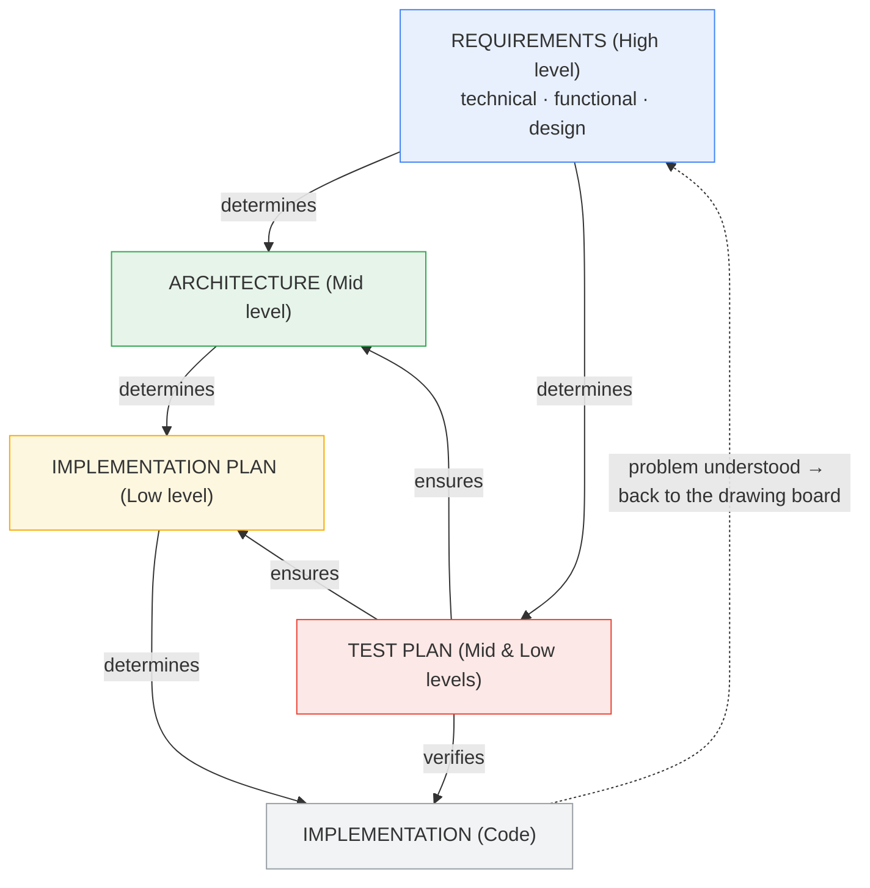

# Methodology: From Requirements to Code

## Purpose of this document

This document records **how work is conducted** on the project: the levels of abstraction
to reason at, how they depend on one another, in which order they are derived, when an
exception is allowed, and how the feedback path on bugs runs. The model is the foundation;
everything else is aligned to it.

---

## Core principles

These principles sit **above** the level model and apply in every phase; therefore, they are also called "Requirement Zero" (R0). All core principles form the project's **supreme directive** and govern how any work is approached.

- **Think first, then act.** Understanding, reasoning, and — at the right level — planning
  precede doing. The entire top-down model is the expression of this principle: code is
  written only after the implementation plan; unfamiliar platform / API internals are
  researched into a verified mental model first, **not** discovered by trial-and-error.
- **Solve problems from the ground up — no band-aid.** A problem must be **understood** and
  solved **cleanly at its root**. "From the ground up" means starting at the **highest
  level** (the requirements — the foundation) and reasoning down, **never** patching at the
  code. A quick patch (band-aid) is only ever a *temporary* correction; the moment one
  appears necessary, that is the signal to return to the top (see the feedback loop).
- **Elegance.** Code should be **elegant**: the solution that, once in place, is the simplest
  *coherent whole* — fewest moving parts, no special cases, reads clearly. Elegance is the end
  that DRY and KISS serve. **On effort:** the elegant path is sometimes *more* work up front —
  e.g. replacing a platform's built-in behaviour with an owned implementation (here: an own
  widget instead of Obsidian's native image rendering). That cost is worth paying when it
  **removes whole classes of special cases** and unlocks simpler, more native solutions
  afterward. Judge a design by its **end state** — total complexity and special cases eliminated
  — **not** by the upfront effort; never reject the elegant path *merely* because it is initially
  more work.
  - **DRY (Don't Repeat Yourself).** The same logic must not appear twice — it is factored
    into shared helpers / inheritance / wrappers, or the platform's own code is reused (e.g.
    Obsidian's `MarkdownRenderer`). DRY targets *logic duplication*; it is never an argument
    against a feature. The same result reached **two different ways** violates it as much as
    copied code does.
  - **KISS & "Less is more" — as simple as possible, but *not simpler*.** When the same result
    is achievable, simpler, cleaner code — **without complex, branched special cases** — is
    always preferable: fewer moving parts, one path. A case that appears "better handled
    specially" is almost always an argument **for** the uniform path — the handling the special
    case needs must exist for the general case anyway, so it is implemented once, for all.
    - **Simplest is not naive.** The quickest, most obvious solution (*quick-and-dirty*) is
      rarely the best one: it tends to miss edge cases, resist extension, and break at scale.
      KISS means reducing a problem to its **essential** simplicity — not below it. Removing a
      necessary distinction is not simplification, it is a defect waiting to surface.
    - **The genuinely simplest solution sometimes looks more involved at first** — an
      abstraction, an established pattern — yet is simpler to read, reason about, extend and keep
      correct, and pays that cost back many times over in fewer bugs and easier change.
    - **Readability outranks cleverness.** Code is read far more often than written; a slightly
      longer, clearly named, well-structured solution beats a cryptic one-liner every time.
      Structure for maintainability — cohesion and clear, single responsibilities — is part of
      keeping it simple, not opposed to it.

---

## Abstraction levels — the concepts and their artifacts

The concepts and their resulting artifacts (a document/deliverable); the abstraction level
is noted alongside, only as orientation:

- **Requirements** — High level (specialized into Technical, Functional and Design)
- **Architecture** — Mid level
- **Test Plan** — Mid & Low level (verifies both the architecture decisions and the implementation)
- **Implementation Plan** — Low level

- **Solid arrows** — the forward flow (what controls what).
- **Dashed arrows** — the feedback loop (implicit)

Each concept and its artifact is described below, with what belongs in it and what does not.

> [!important] The prime rule — a level is a *concept*, not an artifact
> An abstraction level is a **concept**, not the file it produces. Each concept prescribes
> and bounds what belongs in its artifact and what does not; the artifact is produced *from*
> the concept, which is the understanding that keeps it at its altitude. **All** concepts must
> be internalized before any artifact is worked on — knowing only what goes into the
> implementation plan, for example, leads to everything being written there, and the work
> collapses into a single document: straight back to chaos. The boundaries between the
> concepts are what keep each artifact clean. An artifact is correct only when **every
> statement in it belongs to that concept's altitude**.

### Requirements — High level concepts

*Concept:* **what** to build and the **guardrails** for building it — the program's required
behaviour, appearance and build constraints, stated independently of how the code achieves
them.

*Artifact:* the requirements document. Requirements is the umbrella; it specializes into
three, each its own concept and part of that document:

#### Technical Requirements (specialization)

*Concept:* the constraints on **how** the software must be built — platform/technology
mandates, conventions, invariants and non-functional constraints that any solution must
honour.

- **Belongs:** build/runtime constraints ("no runtime dependencies"; "transforms stored
  only in the trailing attr_list block"; "two render paths — post-processor + CodeMirror-6
  widget"), conventions (naming; "ESLint config stays as shipped"), portability mandates,
  and hard lessons that must not be regressed.
- **Does not belong:** which capabilities the user gets (Functional), how anything looks or
  feels (Design), or how a specific function is coded (Implementation).

#### Functional Requirements (specialization)

*Concept:* **what** the program does — the observable behaviours and capabilities, stated
from the product/user perspective.

- **Belongs:** capabilities and behaviours ("non-destructive editing"; "rotate / flip /
  crop / resize / filter"; "renders in both reading view and live preview"; "export";
  "captions from alt text") — the *presence* of a feature.
- **Does not belong:** the visual and user-experience form of a feature (Design), build
  constraints (Technical), or code.

#### Design Requirements (specialization)

*Concept:* **how it looks and feels** — appearance, layout, interaction patterns and user
experience.

- **Belongs:** appearance and interaction rules ("toolbar at the top, revealed on hover,
  inset"; "icon order"; "panels fully visible, never clipped"; "captions centred, muted,
  never wider than the image"; "tap to select on touch").
- **Does not belong:** whether a capability exists at all (Functional), build constraints
  (Technical), or code.

> Functional vs. Design boundary: *"a caption exists and shows the alt text"* is
> Functional; *"the caption is centred, muted and wraps within the image width"* is Design.
> The concept is what draws this line.

### Architecture — Mid level concept

*Concept:* **how the requirements are realized**, conceptually — the building blocks
(modules and their responsibilities), how they interact, the data flow, and the key
decisions/patterns that make the requirements achievable as one coherent whole.

*Artifact:* the architecture document — the building blocks and the key decisions (e.g. one
uniform render path for every image, a declarative and portable rendering contract, a
single shared sub-menu component, pure logic separated from framework-coupled code so it is
testable in isolation).

- **Belongs:** module decomposition and responsibilities, contracts between parts,
  cross-cutting decisions ("one render path for every image"), chosen algorithms or
  approaches **as concepts**, and the patterns that satisfy the requirements.
- **Does not belong:** concrete code internals — method signatures, exact class/file names,
  naming conventions, file-level steps (those are Implementation). The only names that may
  appear here are those a framework mandate forces, and only because they already entered as
  a (technical) requirement. Nor the requirement statements themselves (those are the High
  level).

### Implementation Plan — Low level concept

*Concept:* **how the architecture is built in code**, concretely. This is the first level at
which code internals legitimately appear. It does not invent the algorithms or models — an
algorithm is a mathematical *concept* and lives at the Architecture level (or in the
Requirements, if mandated); the plan records **which realization is used and why this one
rather than another**.

*Artifact:* the implementation plan for a given piece of work.

- **Belongs:** the concrete realization and the choices it requires — which files, functions
  and classes; names and concrete data representations; and which implementation is chosen to
  realize a given algorithm or decision, **and why this one and not another**.
- **Does not belong:** re-opening architecture or requirement decisions (they come from
  above); an **algorithm or abstract data model in itself** (a concept — Architecture, or a
  Requirement if mandated); a **sequence of edits / "change plan"** — the plan defines the
  *target state* (what is implemented), not how to rebuild toward it; a fix that changes the
  target simply updates this definition; and the test specifications (those are the Test
  Plan).

### Test Plan — Mid & Low level concept

*Concept:* **how the work is verified**, at several levels — that it meets the requirements
(behaviour/acceptance), that the **architecture decisions hold**, and that the individual
parts are correct (units). Verification therefore spans both the Mid level (architecture)
and the Low level (implementation), not only the latter.

*Artifact:* the test plan for a given piece of work, produced **in parallel** with the
architecture and implementation plan.

- **Belongs:** the test cases and the level each runs at — unit tests for the implementation,
  integration tests for the architecture decisions and contracts, behaviour/acceptance tests
  for the requirements — what each verifies, and a regression test for every fixed bug.
- **Does not belong:** implementation detail beyond what is being verified.

> The [`release-compliance.md`](release-compliance.md) artifact sits **parallel to the test
> plan** — the test plan verifies *behaviour* (does it do the right thing), release compliance
> verifies *shippability* (may it be submitted). It carries the community-directory release
> requirements: the `R1–R30` audit against Obsidian's Developer policies, Plugin guidelines and
> Submission requirements, plus the manual submission checklist.

**Basic rule:** each artifact is **derived from the one above** and is reasoned about at its
own altitude. A concept's boundaries are enforced both ways: code internals are not dragged
up into the requirements or architecture (except where the framework forces it, below), and
architecture or requirement decisions are not silently made down in the implementation
plan.

> [!example] Sorting test — which artifact does a statement belong to?
> Before writing a statement anywhere, classify it:
>
> - *What* it does → **Functional Requirement**.
> - *How it looks / feels* → **Design Requirement**.
> - A build/runtime constraint, convention or invariant → **Technical Requirement**.
> - Conceptual structure, or a chosen algorithm/approach **as a concept** (modules,
>   responsibilities, interaction, key decision) → **Architecture**.
> - The concrete realization — files, functions, names, data representation, and **which**
>   implementation of an algorithm/decision is chosen **and why** (the algorithm itself is not
>   here) → **Implementation Plan**.
> - A check that something holds → **Test Plan**.
>
> If a statement fits two artifacts, **split it**: the behaviour stays in the requirement, the
> form in design, the structure in architecture, the code in the implementation plan, the
> verification in the test plan.

---

## Exception: framework & predetermined environment

**If** the work takes place within a framework and a predetermined environment — here
Obsidian, with JavaScript / HTML / CSS — **then** code internals can bleed into High-level
or Mid-level reasoning (e.g. "follows Obsidian's central *Use [[Wikilinks]]* setting",
"renders via `MarkdownRenderer`", "CSS custom properties as the rendering contract").

→ In that case, "code internals only at the implementation or test level" is **not a hard
rule** but a guideline: such leaks remain the **exception** and occur only where the
framework forces them — not out of convenience.

---

## Feedback on bugs (back to the drawing board)

A bug is **never fixed where it shows**. The path:

1. **Understand the bug (low-level).** The trigger is located first. A band-aid here is
   permitted *only* as an aid to understanding; it stays temporary and is never the fix
   (core principle "no band-aid").
2. **Return to the top — the drawing board.** Once the bug is understood, the process
   returns to the **highest level (the requirements)** and walks **top-down again** —
   Requirements → Architecture → Implementation — to determine **where it actually hangs**:
   was a requirement missing or wrong? Is the architecture flawed? Only then the
   implementation. The starting point is always the highest level.
3. **Fix at the origin, re-derive downward.** The cause is corrected at the level where it
   originates, and the change flows back down. This can entail **large code changes**, but
   usually resolves **many problems at once** and removes the band-aids introduced for
   diagnosis.

> Skipping the top-down pass is precisely what leaves a **quick fix**. "Solve from the
> ground up" = always begin at the **highest level**; the "ground" is the foundation (the
> requirements), not the code. This is the operational form of the supreme directive
> (DRY/KISS, "no special cases"): a branch that survives the top-down review was a hidden
> requirement; one that does not belongs removed by the correction further up.

---

## Resulting working rules (summary)

- Order: **Requirements → Architecture → Implementation plan (with the Test plan in
  parallel) → Code**; code only after the implementation plan.
- **Requirements** are split into **Technical**, **Functional** and **Design**
  requirements.
- Abstraction levels (High level, Mid level, Low level) are **concepts to reason within**,
  not deliverables.
- Each level **derives from the one above**; a change at the top may (and should) force
  large changes below.
- The **test plan is created in parallel** with the architecture and implementation plan,
  not afterward.
- Code internals at the High level or Mid level only where the framework **forces** it —
  exception, not rule.
- On a bug: understand it low-level, then **return to the top** (requirements) and
  re-derive top-down to find and fix the real cause — never a one-level patch.
- After every **larger code change or fix**, **bump the version** (patch-only —
  `<major>.<minor>.<patch>`, never a minor/major jump; see CLAUDE.md) and write the matching
  **changelog** entry before moving on —
  it is part of finishing the work, not a release-only step. **Documentation-only changes
  do not bump the version.**

> [!note] Conventions & conduct
>
> - Project documents are written in an **impersonal, professional register** (no
>   "we" / "you").
> - Confirm before **irreversible or outward-facing** actions; the **user makes the git
>   commits** — the agent **reminds** when a commit is due (commit **regularly**, and it is
>   **mandatory** on a version change), never commits itself.

---

## Application

On this basis, the **highest level — the requirements** is defined first, split into
**Technical**, **Functional** and **Design** requirements, free of code internals except
where Obsidian / JavaScript / HTML / CSS forces them. From the requirements follows the
architecture, from that the implementation and test plans, and only then the code. Existing
findings from code audits (e.g. duplication / special cases) are not used directly as a
work plan but as *input*: each is checked for whether it traces back to a missing
requirement or an architectural weakness, and corrected there.
