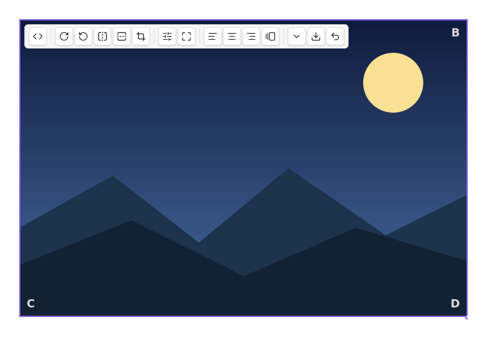
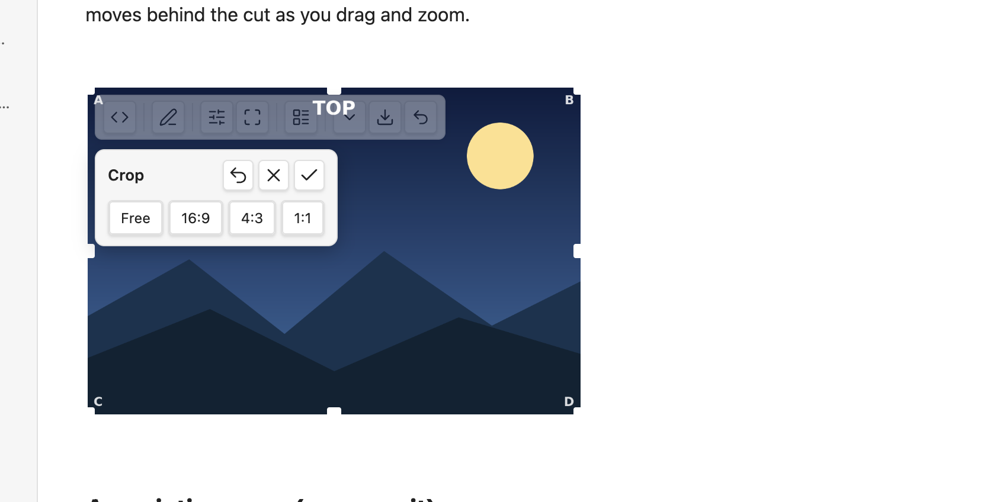
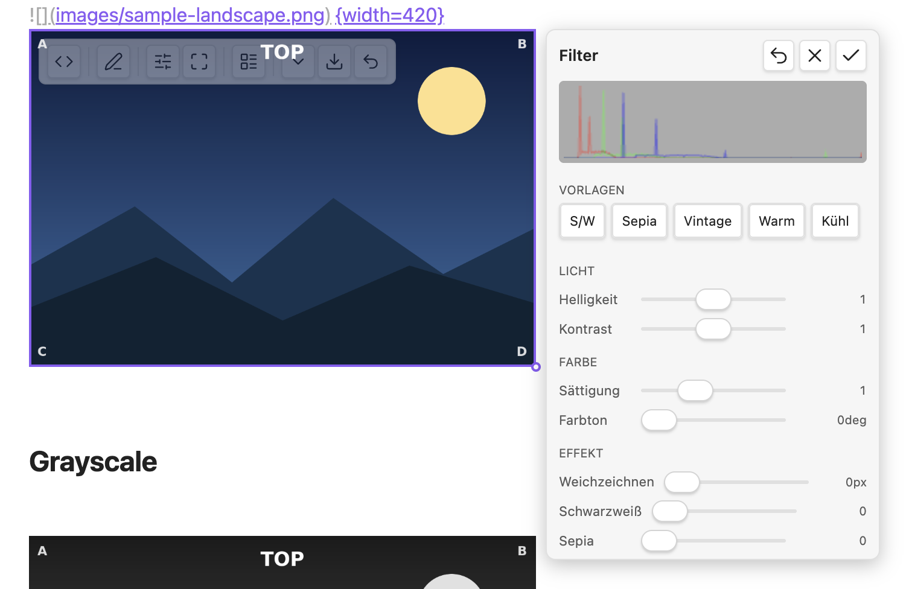
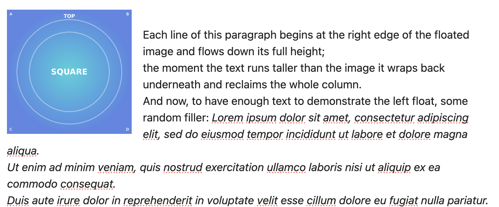
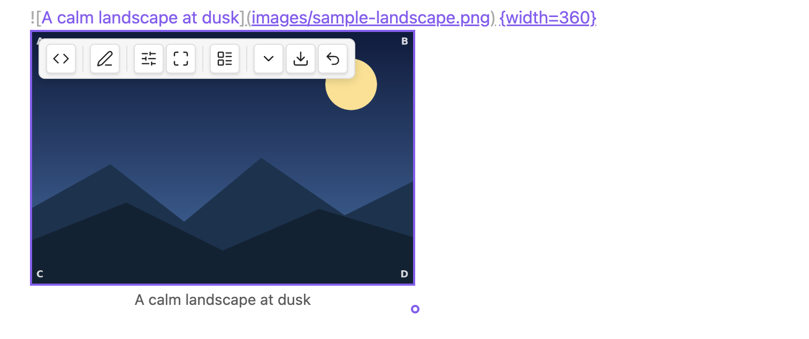

---
hide:
  - navigation
---

# Live Image Editor — User Guide

Live Image Editor lets you rotate, flip, crop, resize, filter, align and export images **right in
your note** — without ever changing the image file. Every edit is stored as a small, portable text
tag on the image's own line, so your originals stay untouched and your notes stay plain Markdown.

It works in both **Live Preview** and **Reading view**, follows your Obsidian language, and follows
Obsidian's central *Use [[Wikilinks]]* setting — it adds no link or language setting of its own.

---

## The toolbar

Hover an image (or tap/click it on mobile) and a toolbar appears at the top of the image:

From left to right: **show/hide the link** (`<>`), **edit** the raw link, **filters**, **crop**,
**layout** (align / inline), **size** (the ⌄ menu), **export**, and **reset**. On a narrow image
the toolbar folds groups into a sub-menu and wraps so nothing is ever clipped.

A grey circle on the bottom-right corner is Obsidian's native **resize handle** — drag it to change
the width.

---

## Rotate & flip

Use the rotate buttons for quarter-turns (90° / 180° / 270°) and the flip buttons for horizontal or
vertical mirroring. The image's footprint always hugs the result — a rotated image is never boxed in
empty space, and never spills past your text column:

For **free-angle** rotation, use the rotate knob inside the crop editor (below). On a Mac trackpad
you can also use the two-finger rotate gesture while cropping.

---

## Crop

The crop button opens an editor **in place** — the image doesn't jump or reflow:

- **Drag** the image to pan, **scroll** or **pinch** to zoom, and use the **rotate knob** for free
  rotation. The corner handles keep the aspect ratio; the edge handles change one side.
- The **aspect presets** (Free, 16:9, 4:3, 1:1, …) reshape the cut window.
- Outside the cut is dimmed; inside is full.
- **Reset** (↺) returns to the full image; **✗** or **Esc** discards your changes.
- Just **leave** the editor (click away, press **Enter**, or toggle crop off) to keep the result —
  it's saved as a single step, so one **Cmd/Ctrl-Z** undoes the whole crop.

Crops stay sharp and rescale with your column — the cut is stored as a shape, not a fixed pixel size.

---

## Size & presets

Drag the native handle, or open the **size** menu (the ⌄ button) for one-tap presets and exact
width/height fields:

- **Icon** — shrinks the image to an inline icon that flows within your text.
- **Small / Medium / Large** — set the widths you configure in settings.
- **Original** — clears the width back to the image's natural size.

Setting a width keeps the aspect ratio; setting both a width *and* a height lets you stretch
deliberately.

---

## Filters

The filter button opens a panel with a live histogram, named presets (B&W, Sepia, Vintage, Warm,
Cool) and sliders grouped by purpose:

Adjust **brightness, contrast, saturation, hue, blur, grayscale, sepia**; double-click a slider to
reset it. Filters are a live preview while the panel is open and are saved once when you leave it.
They are part of the **export** (below), so the exported file carries the look you see.

---

## Layout — align, float & inline

The layout button toggles how the image sits in the text:

- **Left / Right** — the image floats and the text wraps around it (in both views).
- **Center** — a centered block on its own line.
- **Inline** — icon-sized, flowing within the line of text.

---

## Captions

Turn captions on in **Settings → Live Image Editor → Show image captions**. The image's **alt text**
then shows as a caption below it, rendered as Markdown (bold, italic, links, code):

The caption is centered, muted, and never wider than the image — a long caption wraps within the
image width. The alt text stays the single source: edit it in the link and the caption follows.

---

## Classes & snippets

The **Add class** button (in the layout area) offers any image CSS class it finds in your vault's
enabled CSS snippets, each individually toggleable. The plugin also ships example decoration classes
— **rounded**, **shadow**, **bordered**, **circle** — that you can install from settings (they're
editable, and a reset restores the originals).

---

## Export

The export button renders the image **exactly as you see it** — rotation, flip, crop and filters
baked in — to a new image file at full original resolution (the display width never lowers the
export quality). On desktop you get the native save dialog at the original's folder; it never
overwrites silently.

---

## Settings

**Settings → Live Image Editor**:

- **Show hover toolbar** — the editing toolbar on hover/selection.
- **Show image captions** — render alt text as a caption (off by default).
- **Always show the link source** — *auto* (reveal the raw link on hover or the cursor line) or
  *always* (reveal everywhere). Default: auto.
- **Preset widths** — the Small / Medium / Large widths.
- **Detected snippet classes** — toggle which discovered image classes are offered.
- **Install / reset example snippets** — the bundled decoration classes (opt-in).
- **Editing-toolbar integration** — optionally add the image commands to the *editing-toolbar*
  community plugin (off by default).

---

## Commands

Every action is also available as a command (and through the optional editing-toolbar integration),
active when an image is in context: rotate, flip, crop, the size presets, alignment, inline toggle,
add class, reset, and export. Bind the ones you use to hotkeys in **Settings → Hotkeys**.

---

## How edits are stored (and what happens without the plugin)

Each edit is written as a short tag after the image, e.g.
`{rotate=90 width=420}` or `![[photo.png]]{align=left}`. The image file is never
modified. Open the same note **without** the plugin (or publish it elsewhere) and the image still
shows — width and alignment carry through anywhere, and the runtime-only effects (rotate, flip, crop,
filter) simply fall back to the original, untransformed image.
