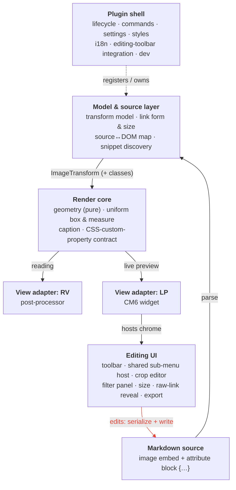

# Architecture — Live Image Editor

> The architecture artifact — the **Mid-level concept** from `methodology.md`: *how* the
> requirements in `requirements.md` are realized, conceptually. It records the building blocks
> and their responsibilities, the data flow, how they interact, and the load-bearing decisions
> that make the requirements achievable as one coherent whole.
>
> **Abbreviations:** **AD** = Architecture Decision (§2); **AB** = Architecture Building Block
> (§4); **Fn / Dn / Tn** = the functional / design / technical requirements in `requirements.md`,
> where those references point.
>
> Everything here is stated as **concepts**: files, functions and other code internals are the
> implementation plan's job, not this document's — the sole exception being framework names
> (Obsidian / JS / CSS) where the platform forces them.

---

## 1. Shape at a glance

Four layers, plus a plugin shell that wires them together. The data flows in one direction
for rendering and round-trips through the source for editing.

The **render** direction (source down to pixels) is a pure function of the source. The
**edit** direction — the red edge closing the loop: Editing UI → write to source → re-parse →
re-render — is the only way display state changes; there is no second store to keep in sync
(AD1).

---

## 2. Load-bearing decisions

These are the cross-cutting decisions that make the requirements hold together. They are the
reason the module decomposition looks the way it does; most are already embodied in the
current code and are restated here as architecture, not invented anew.

- **AD1 — Source is the single source of truth.** *(F1, F2, F3, T2)* The displayed image is a
  pure projection of the current Markdown; all transform state lives in the trailing
  attribute block and nowhere else. Every edit serializes back into that block and re-parses,
  so no cached or stale render state can survive a mode switch or a reused embed. The model
  layer owns parse/serialize; the editing UI never mutates display state directly, only the
  source.

- **AD2 — Declarative rendering contract; native CSS preferred.** *(T2, T3, F1, F25)* Transforms
  are stored **declaratively** in the embed's `style` and classes — never imperative DOM
  scripting. Where a transform has a **native CSS equivalent** (rotation, flip, all filters) the
  **native shorthand** is used (`transform`, `filter`), so the image renders in any renderer with
  no plugin and no shipped CSS (strongest backward-compatibility, F25). Even **crop** is native
  (its placement is the img's `transform`); only the **clip** needs the wrapper. Named/semantic
  state stays in classes (alignment, inline; decoration via shipped snippets). Each value is routed
  to the element it must act on **by property name** — `transform`/`filter` to the **img**,
  `width`/`height` to the **box**, alignment classes to the **embed**. This is **less work than
  custom properties**: the native `transform`/`filter` string *is* the final CSS, so the render
  path applies it **verbatim** — no value parser, no `--lie-*` → CSS composing rule, no
  serialize/parse mapping (and arbitrary extra transform functions pass through). Only the editing
  tools and the rotated-box reflow read the one token they need.

- **AD3 — One uniform image element, one sizing direction (R0).** *(T5, T6, D3, D4)* Normal, rotated,
  flipped, cropped, filtered and sized images share the **same** nested structure (embed → box →
  img) and the **same** sizing routine; "normal" is the degenerate transform, never a special
  case. The box clips **uniformly** (so crop is not a structural fork — it is just the case with
  content beyond the box). Sizing runs **one way: the size attribute sizes the box, and the inner
  image is a pure function of the box and the transform** — never the reverse. That single
  direction is the permanent guard against the recurring rotated-image sizing drift (there is no
  measure-the-image-then-size-the-box loop that can fall out of sync) and is what makes every
  image behave like a native embed. Layout and alignment act on the **embed** (the document-flow
  participant), not the image, so surrounding text wraps.

- **AD4 — Two view adapters, one render core.** *(T4, F4)* Reading view (a Markdown
  post-processor) and live preview (a CodeMirror-6 extension) are separate **only** because
  Obsidian renders the two modes through different machinery. Everything below the adapter —
  geometry, the uniform box, the caption, the CSS contract — is shared, so both adapters
  produce the same DOM structure and the same visual result.

- **AD5 — Live preview keeps the line native; the plugin renders its own image widget (and kills the native image uniformly).** *(T6, F3,
  F17, F8, F9, F18)* Within a mode an image is rendered by exactly one pass. The live-preview adapter
  **does not replace** the image line: it lets Obsidian render the native embed (so the file loads and
  the source keeps Obsidian's own cursor-reveal), **suppresses the native image with static CSS**, and
  draws the plugin's own transformed image (AD3) — and the native image is **suppressed UNIFORMLY**
  (every embed, unscoped). The plugin's widget renders in **every** case: a `{…}` embed keeps
  Obsidian's `.cm-line`, so it is an **inline widget IN that line** — rendering inline (rather than a
  block widget below) is load-bearing, because the host cm-line is left a **non-BFC**, so a
  `lie-left`/`lie-right` `float` **escapes** into `.cm-content`'s block formatting context and shortens
  the following sibling cm-lines (F18 — real multi-line wrap), with **no height desync** (the float
  counts to no line's height) and no `contain:paint` clip, and the image **shares the cm-line** with the
  source, giving the reveal a uniform home. A **bare** `` line (no `{…}`) is block-promoted by
  Obsidian into a cm-line-less `.cm-content` child that would swallow an inline widget — so the plugin
  renders a **`block:true` widget** for it instead, landing as its own `.cm-content` child next to the
  (image-suppressed) native embed. There is **no normalization**: `{…}` is written only by a real plugin
  action (a floated image carries it via its alignment class), so no embed needs a marker or auto-rewrite
  to render. Three things ride on the line, declaratively in CSS with no measurement
  loop and no edit field: (1) the attribute block `{…}` is literal text — **hidden when rendered** so F3
  holds, shown while editing; (2) a display-only **fake raw link** is the *reveal-for-looking* (F8),
  shown by CSS on cm-line **hover** or in always-mode (the **global default-state setting**, AB19/F20)
  and **suppressed by the `<>` toggle** — a CSS-keyed class, not persisted per image; (3) **editing** is
  Obsidian's **own cursor-reveal** of the source as real document text (F9) — caret, selection and copy
  are native, and the fake link **yields** to the native source while the line is active (`.cm-active`)
  so the link is never shown twice. A **tall-float cap** preserves cross-view consistency: a float
  taller than CM6's ~250px render margin (which would derender on scroll in LP) falls back to a
  non-floated block in **both** views, governed by a setting (AB19). This **embraces** the behaviour the
  old "always replace" rule avoided (an un-replaced line re-fires Obsidian's native embed — the L1
  *observation* still holds): the native embed is now *wanted* for its image load and cursor-reveal, and
  merely CSS-hidden. Reading view is unaffected by the cursor logic (no editing). No competing passes.

- **AD6 — Sizing is declarative; the original ratio is the ground truth.** *(T7, T11)* The box's
  vertical extent is an **`aspect-ratio`**, never a fixed height. The **original image's intrinsic
  ratio is the always-available ground truth**: the box ratio is **derived** from it (plus the
  angle, for rotation) — read when the image loads, **not** measured from the rendered,
  column-dependent box, so there is **no measure-then-resize retry loop** (the root of the recurring
  sizing drift, designed out). An explicit `aspect-ratio` is **stored only for a deliberate,
  non-derivable aspect change** (a distorting resize, a width+height modal, or an off-original crop
  frame); it is the genuine user intent. The derived ratio is **applied to the DOM as an overridable
  default, never written into the source** (which would make the plugin edit the text the user
  edits — a JS-vs-editor race); CSS precedence resolves the rest with **no source parsing** (ignored
  when both `width`+`height` are set; a stored `aspect-ratio` overrides). Being width-*independent*,
  it survives manual `width` edits and is responsive; and because everything falls back to the
  ground-truth ratio, a **missing or hand-edited** value degrades sensibly (T11) rather than
  breaking — even with cached images, reused embed DOM, mode switches, or a **backgrounded window**.

- **AD7 — Decision logic is extracted into pure units.** *(T8)* Geometry, line→decoration
  mapping, caption-text extraction, crop quantization, sub-menu state and link-form
  normalization live in framework-free units that are unit-tested in isolation; the
  framework-coupled modules stay thin wrappers around them. Integration and behaviour are
  verified in the running app.

- **AD8 — One shared sub-menu host for all editing panels.** *(F14, D6)* Crop, Filters, Export
  and Resize open through a single host that provides the greyed-toolbar state, the
  icon-based reset/accept/dismiss actions, Esc-to-dismiss and the open/close toggle. Placement
  is the only thing that varies by size (compact menus hang under the toolbar; the large
  filter panel docks beside the image). The behaviour is implemented once, not per feature.

- **AD9 — Reuse the platform (DRY).** *(F5, F6, F21, F22, D4, F13)* Where Obsidian already
  provides the capability, the platform's own code is the building block: `MarkdownRenderer`
  for captions, the native resize handle and frame, the native save dialog, the file
  manager's link generation for link-form conversion (used defensively), and Obsidian's locale
  and strings for i18n. The plugin adds the missing logic around these, never a parallel
  reimplementation.

---

## 3. Data flow

**Render (source → pixels).** The adapter for the active mode reads the image line, the model
layer parses the attribute block into a transform plus class list, the render core produces the
uniform box and emits the declarative CSS contract, the static stylesheet rules apply it, and —
if captions are on — the caption is rendered below and sized to the box. Identical core, two
adapters (AD4); the result is a pure function of the source (AD1).

**Edit (interaction → source → pixels).** A toolbar action (or a sub-menu accept) yields a new
transform/class state. The model layer serializes it into the attribute block and the
source↔DOM map locates the line; the edit is written to the document without moving the cursor
or scroll (D11). The document change re-triggers the adapter, which re-renders through the
same core. No editing component writes display state directly — closing the loop through the
source is what guarantees both views and any later reload stay consistent (AD1, F2).

---

## 4. Building blocks

Each block (**AB**) is a concept with a single responsibility; blocks interact only across the
arrows in §1, with the data flow of §3. The concrete realization (files, functions, data
shapes) is the implementation plan's job, not this document's.

### 4.1 Model & source layer

The boundary between Markdown text and everything above it. Pure where possible (AD7).

- **AB1 — Transform model** — owns the canonical transform model and its bidirectional mapping
  to/from the portable attribute block (AD2, T2); the single place that knows the block's
  syntax, identical for the Markdown (T2.1) and wikilink (T2.2) form. Hands the parsed transform
  and classes to the render core.
- **AB2 — Link form & native-size normalization** — keeps the link type as written, converts
  between the Markdown (T2.1) and wiki (T2.2) form when Obsidian's central setting demands it
  (carrying the attribute block across intact), and folds a Markdown native size into the block
  while leaving a wikilink's native size as-is (F5, F6).
- **AB3 — Source↔DOM mapping** — maps a rendered image to its position in the Markdown source so
  an edit knows which line to rewrite, without moving the cursor or jumping scroll (D11).
- **AB4 — Snippet class discovery** — reads the vault's CSS snippets, extracts image-targeting
  classes, filters out internal and platform classes, and refreshes on load and on change (F16).
  Also **ships installable example decoration snippets** (opt-in, resettable) that surface
  through the same path (F16.1).

### 4.2 Render core (shared by both views)

The shared realization of AD3/AD4 — given a transform and classes, produce the uniform DOM and
the correct geometry.

- **AB5 — Geometry (pure)** — the box and inner-image geometry as pure functions of the image's
  **intrinsic ratio** and the transform — no DOM measurement. The **single source** consumed by the
  render core (to derive the box's `aspect-ratio`) and the **canvas export**. Unit-tested (AD7).
- **AB6 — Uniform box** — builds the same wrapper box for every image and gives it an
  **`aspect-ratio`** derived from the intrinsic ratio (+ transform), **applied to the DOM, not
  written to the source** (AD6); the inner image follows in box-relative units, and the box clips
  uniformly. The image's own visuals (rotate/flip/filter, and a crop's pan/zoom) are native CSS on
  the img (AD2).
- **AB7 — Caption** — renders the alt text as a Markdown caption below the image via the platform
  renderer (AD9). It is a child of the **embed** (below the box, never inside it) and is sized to
  the box width by the **embed's own CSS** — the embed shrink-wraps to the box and the caption is
  constrained to that width — so it needs **no JS width-sync / ResizeObserver**. Text extraction is
  pure and tested (F22, D9). When the image is too small to carry a caption below it, the
  caption is shown on a delayed hover instead (D9.1).

### 4.3 View adapters

Thin per-mode bindings (AD4); they decide *where/when* to invoke the render core, not *how* an
image looks.

- **AB8 — Reading-view adapter** — runs on rendered sections, hands each embed to the render
  core, attaches the editing chrome.
- **AB9 — Live-preview adapter** — a CodeMirror-6 editor extension that, for every image embed
  (standalone or mid-text), **leaves the line's text intact**, draws the plugin's uniform widget, and
  **CSS-suppresses Obsidian's native image UNIFORMLY** (every embed, AD5). The widget renders in every
  case: a `{…}` embed → an **inline widget IN its `.cm-line`** (so a `lie-left/right` float escapes the
  non-BFC line and wraps text, F18); a **bare** embed (no `{…}`, block-promoted, no cm-line) → a
  **`block:true` widget** next to the image-suppressed native embed. It hosts **no** editable field for
  the raw link: the **reveal-for-looking** (F8) is a display-only fake link plus the `{…}`, shown/hidden
  by CSS on cm-line hover and always-mode and yielding to the native source while editing; **editing**
  (F9) is Obsidian's own cursor-reveal of the source as real document text (one editing root → native
  caret, selection, copy). Inline (mid-text) embeds get the same widget; only chrome placement differs
  (AD3). The old duplicate-native-embed hazard is gone because the native image is uniformly hidden, not
  fought.

### 4.4 Editing UI

The chrome attached by the adapters; all panels share one host (AD8). None of these mutate
display state — each produces an edit that round-trips through the model layer (AD1).

- **AB10 — Toolbar** — hover/selection-revealed control bar with the defined order, grouping and
  divider-wrapping (D1, D2, F7); the entry point to every editing action. Sits inset at the
  image top, or **above** the image when it is too small to hold the bar (D1.1). That too-small
  placement is **declarative — a CSS container query on the box — with no JS measurement**.
- **AB11 — Shared sub-menu host** — the one component realizing AD8 (greyed toolbar, icon
  actions, Esc, open/close toggle, per-panel reset); its placement logic is pure and tested.
- **AB12 — Crop editor** — the in-place crop overlay with movable/rotatable/scalable original and
  resizable frame; quantization to whole pixels and fixed angle steps **during** the interaction
  is pure and tested (F12, D8).
- **AB13 — Filter panel** — the docked panel with histogram and grouped sliders, including the
  temperature approximation; reads/writes the declarative contract (F11, D7).
- **AB14 — Size sub-menu** — the size presets (icon/small/medium/large/original) plus manual
  width/height entry fields side by side, hung under the toolbar through the shared host
  (F10, F24, D6.1).
- **AB15 — Export** — replays the **same** box geometry, transform and filter (from AB5) onto a
  canvas whose bounds clip the result like the wrapper — the **same visual** as displayed, but
  sized from the **original image's native resolution** (highest quality; the display size does not
  reduce it, F13), with **no** parallel crop/rotate math. Decoupled from the save, which offers the
  native dialog with a free name pre-filled and never overwrites silently (F13, AD9).
- **AB16 — Raw-link reveal & edit** *(F8, F9, D5)* — **reveal** is a display-only fake raw link the
  plugin paints before the `{…}`. The **`<>` reveal control** is a **transient** toggle, **not
  persisted per image** (F8; a class on the box the CSS keys on): **Show** = the reveal follows the
  **global default-state setting** (AB19/F20) plus the cursor (`.cm-active`) and hover reveal (pure
  CSS); **Hide** = the reveal is **temporarily suppressed entirely** (to inspect the layout). There is
  **no** per-line AUTO/ON/OFF mode.
  Only the in-widget **edit field** is designed out: **edit** is **not**
  a plugin field — it is Obsidian's native cursor-reveal of the source text (AD5, AD9), independent of
  the reveal mode, so caret, selection and copy are native. No separate editing root, so the old
  in-widget-textarea seam is designed out.

### 4.5 Plugin shell & cross-cutting

- **AB17 — Lifecycle** — registers the two view adapters, commands and settings; owns load/unload.
- **AB18 — Commands** — image-context commands, active only when an image is in context (F19).
- **AB19 — Settings** — the general toggles (hover toolbar, captions, default raw-link reveal
  state), the **preset widths**, the snippet list with per-class toggles plus **install / reset
  of the bundled example snippets**, and the optional editing-toolbar integration (F20, F16.1).
- **AB20 — Style injection** — installs the internal prefixed CSS: the alignment/inline classes
  and their `:has()` float routing (a `lie-left/right` float escapes the non-BFC cm-line; `z-index:1`
  keeps the floated image clickable), the box/overflow rules, the **tall-float cap** (a `.lie-tall`
  float stacks as a block under `body.lie-safe-tall-float`), and the configurable preset-width
  variables, shared with the render core (F15, F18, F24, T9). It also carries the **live-preview reveal
  CSS** (AD5): the rule that hides Obsidian's native image **uniformly in every embed** (never the
  plugin's own `.lie-wrapper`), and the
  hover/`.cm-active`-keyed rules — plus the `<>`-toggle class and the global default-state class — that
  hide the `{…}` and the fake raw link when rendered and reveal them otherwise. It carries **no**
  transform/filter rules (those are native CSS, AD2) and **no** decoration classes (shipped as
  snippets, F16).
- **AB21 — Localization** — follows Obsidian's locale, reusing platform strings, English fallback
  (F21, AD9).
- **AB22 — Editing-toolbar integration** — installs/removes the plugin's commands into the
  separate editing-toolbar plugin's bar; optional, off by default, version-gated (F23, T10).
- **AB23 — Dev bridge** — CDP relay, dev builds only, tree-shaken from production.

---

## 5. Requirement → block / decision traceability

Confirms every requirement is realized by a building block or decision (and surfaces any gap).

| Requirement | Realized by |
|---|---|
| F1 Non-destructive | AD1, AD2 · Transform model |
| F2 Source is truth | AD1, AD5 · view adapters re-render from source |
| F3 Block never shown as text | AD5 · `{…}` CSS-hidden when rendered (keyed on `.cm-active`), shown when editing |
| F4 Both views | AD4 · Render core + two adapters |
| F5 Link form follows Obsidian | AD9 · Link form normalization |
| F6 Native size folded in | Link form normalization |
| F7 Toolbar activation | Toolbar (selection + hover) |
| F8 Raw-link reveal | AB16 · display-only fake link, CSS-toggled (hover/focus/`.cm-active`) · Settings (default state) |
| F9 Raw-link edit | AB16 · Obsidian's native cursor-reveal of source (AD5) |
| F10 Transform set | Render core · Toolbar · Size sub-menu |
| F11 Filters | Filter panel · AD2 contract |
| F12 Crop (live quantization) | Crop editor (+pure logic) |
| F13 Export | Export · AD9 (native dialog) |
| F14 Shared sub-menu | AD8 · Shared sub-menu host |
| F15 Built-in classes (align & inline) | Style injection · Toolbar/commands |
| F16 Vault-snippet classes | Snippet discovery (+bundled examples) · Settings |
| F16.1 Bundled snippets opt-in (install/reset) | Snippet discovery · Settings |
| F17 Inline images | AD5 · Live-preview adapter (inline overlay, same uniform widget) |
| F18 Float & text wrap | AD2/render core (class on img, float on embed) |
| F19 Commands | Commands |
| F20 Settings | Settings |
| F21 Localization | AD9 · i18n |
| F22 Captions | Caption block · AD9 |
| F23 Editing-toolbar command install | Editing-toolbar integration · Settings |
| F24 Size presets | Size sub-menu · Style injection (preset-width vars) |
| F25 Never emit plugin-only Markdown | AD1, AD2 · Transform model (storage format) |
| D1 Toolbar placement | Toolbar |
| D1.1 Too-small → toolbar above | Toolbar |
| D2 Order & divider-wrapping | Toolbar |
| D3 Responsive & column-capped | AD3 · Geometry |
| D4 Native resize handle | AD3, AD9 |
| D5 Reveal appearance | Raw-link reveal |
| D6 Sub-menu appearance | AD8 · Shared sub-menu host |
| D6.1 Resize panel contents (presets + W/H fields) | Size sub-menu |
| D7 Filter panel docking | Filter panel |
| D8 In-place crop | Crop editor |
| D9 Caption appearance | Caption block |
| D9.1 Too-small → caption on hover | Caption block |
| D10 Native spacing | Style injection (on the embed) |
| D11 No disruption | Source↔DOM map (write without cursor/scroll move) |
| T1 No runtime deps | Crop/histogram/export all in-house (canvas) |
| T2 Portable storage | AD2 · Transform model |
| T3 Portable rendering | AD2 |
| T4 Two paths, one result | AD4 |
| T5 Uniform wrapper | AD3 |
| T6 One path per mode | AD5 |
| T7 Robustness | AD6 |
| T8 Testable by extraction | AD7 · the `*-logic` units |
| T9 Naming & conventions | Style injection (prefix) · build config |
| T10 Editing-toolbar integration | Editing-toolbar integration |
| T11 Robust to hand-edited / partial source | AD6 (original ratio = ground truth; graceful fallback) |
