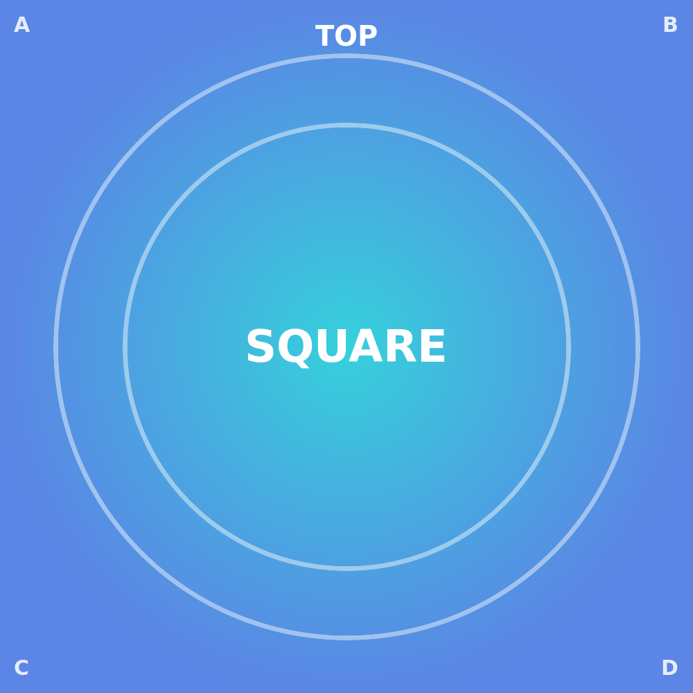

# Crop

The crop button opens the editor **in place** — the image stays exactly where it sits in the note,
with no jump or reflow. Inside the editor you **drag** to pan the content behind the cut, **scroll /
pinch** to zoom, turn the **rotate knob** for free (non-quarter) rotation, and pick an **aspect
preset** (1:1, 4:3, 3:2, …) to reshape the cut window. Everything outside the cut is **dimmed** and
everything inside stays at full brightness, so you always see what you keep versus what you trim.

Leaving the panel **persists the crop once** — a single Cmd/Ctrl-Z undoes the whole crop in one
step, not handle-by-handle. **Reset** restores the full, uncropped image; **✗ / Esc** discards the
edit and leaves the note untouched.

Nothing is ever written to the image file. The crop is stored portably on the image's Markdown line
as a placement `transform=` (where the content sits behind the cut) plus the cut shape
`aspect-ratio=` — deliberately **never** a fixed pixel height. That keeps the image sharp and lets
the crop rescale together with the text column when the note width changes.

## A plain image — open crop on it

Start here: hover the image, hit the crop icon, and try **pan / zoom / rotate / the aspect presets**.
The corner labels (**A**–**D**) and the **TOP** marker make it easy to read exactly how the content
moves behind the cut as you drag and zoom.

## An existing crop (re-open it)

This landscape already carries a crop — a centred 4:3 window, the content scaled up `1.4×` and
nudged slightly up-and-left. Re-open the editor and you'll see the **same** cut you left behind, not
a reset to the full image: the stored `transform=` / `aspect-ratio=` round-trips exactly. Resizing
the width afterwards keeps the cut intact and simply rescales it with the column.

{transform="translate(-12%, -6%) scale(1.4)" aspect-ratio=4/3 width=300}.

## A centred square crop of the square sample

The square sample with its outer edges trimmed away on all four sides — a `2×` zoom centred on the
middle, shown at 260 px. A good check that a symmetric crop really stays centred and that the 1:1
cut shape holds at whatever width the note is displayed.

{transform="translate(-50%, -50%) scale(2)" aspect-ratio=1/1 width=260}

## Rotated *and* cropped (orientation is decoupled)

Frame orientation and content placement are two independent things. Here the frame is turned a
quarter-turn (`rotate=90`) while the crop (`transform=` / `aspect-ratio=`) acts on the content
*inside* that frame. Re-orienting the frame never disturbs the cut, and re-cropping never resets the
rotation — you can change one without touching the other.

{rotate=90 transform="translate(0%, 0%) scale(1.2)" aspect-ratio=3/4 width=240}

## Duplicate file (the right occurrence is edited)

The same image file is embedded **twice** below, with identical attributes — so the two copies look
exactly alike. That sameness is deliberate and is the whole point of the test: this is the *starting*
state, not a before/after comparison. Nothing here is pre-cropped, so there is intentionally no
visible difference to spot yet.

Now try it: open the crop editor — or any other edit, rotate / flip / resize / filter — on the
**second** image, then look at the Markdown source. Only the **second** `` line gains the new
`{…}` block; the **first** line stays untouched. Do the same on the first image and only the first
line changes. The edit always follows the copy you actually touched.

That sounds obvious, but it's exactly the case an earlier version got wrong. Because both embeds
point at the *same file name*, the old write-path resolved an edit by file name and always landed on
the **first** matching line — so editing the second copy silently rewrote the first, and the visible
change snapped back to the wrong image on the next reload. (Only the resize handle escaped this, via
a separate code path, which is why a width change would persist while a rotate or crop didn't.) The
plugin now resolves the target by its **exact position in the document** rather than by file name, so
the write lands on the occurrence you edited — identically in **Live Preview** and **Reading view**.

{width=200}

{width=200}
